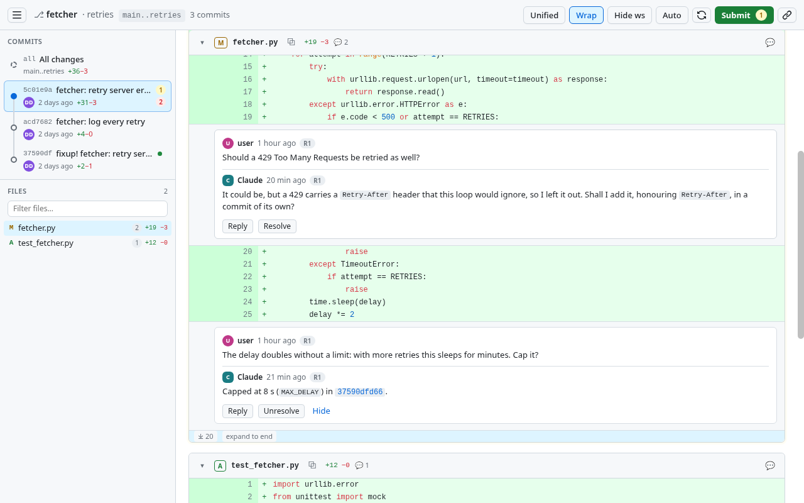
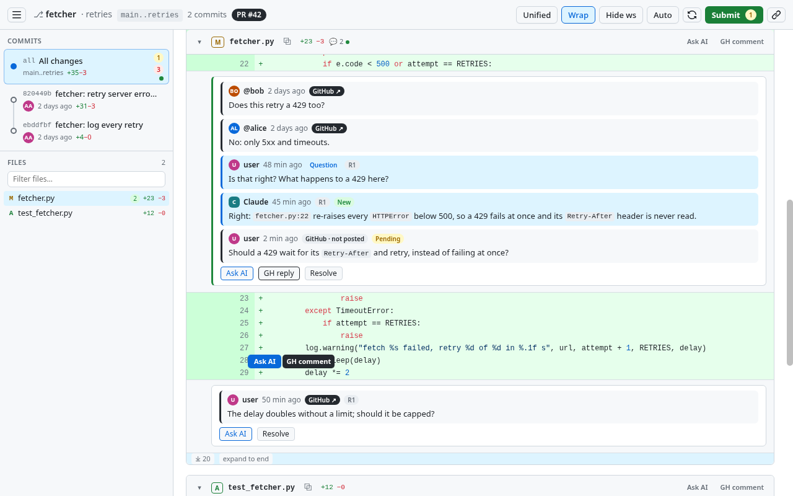

# ccr — Commit Chain Reviewer

ccr is a GitHub-like review page for a chain of git commits. It runs on your machine, with Claude Code at the other
end: you read the change in the browser and comment on lines, files, commits or the change as a whole, and Claude
reads every comment from the command line and answers in the same threads. There are two ways to use it.

## Reviewing the commits your agent wrote

When Claude has made a change, ask it to show you the code, or run `/review-commit-series main..HEAD`. It starts
ccr on the commits with a cover letter describing the change and hands you a URL.

Comment as you would on GitHub, then click **Submit**: your comments become a round. Claude takes the whole round,
fixes the code in new fixup commits, answers every thread, citing the commit with the fix or asking back, and the
page updates by itself. Repeat until you have nothing left to say. The cover letter becomes the pull-request
description.

## Reviewing someone else's pull request

Ask Claude to review a pull request with ccr, for example *"review https://github.com/OWNER/REPO/pull/N with ccr"*.
It checks the pull request out into a worktree of its own and starts ccr with the pull request body as the cover
letter, so **All changes** is exactly the diff GitHub shows. Claude changes no code here. Lines and files offer two
buttons, and so do the threads that come from GitHub:

* **Ask AI**: a question for Claude, answered in the thread. Nothing goes to GitHub.
* **GH comment**, or **GH reply** in a GitHub thread: a message for the pull request. When you submit, Claude checks
  it against the code and posts it verbatim into your pending GitHub review, or replies with what is wrong with it.

The pull request's discussion on GitHub comes in too, so you can ask Claude about a GitHub thread or answer it on
the spot, in that same thread. The background colour tells the two dialogues apart: **blue** for yours with Claude,
**grey** for the messages from and to GitHub, both the ones that came from there and yours, posted or still a draft.
The editor takes the colour of what you are writing. Submitting the review, with its verdict, stays yours, on
GitHub.

## Install

Give Claude this:

> Install ccr: `git clone https://github.com/ScyllaPiotr/commit-chain-reviewer.git ~/.claude/skills/ccr`. Check that
> `python3 -c 'import sqlite3, sys; assert sys.version_info >= (3, 10)'` succeeds and that `git --version` is 2.24 or
> newer; for pull requests, also that `gh auth status` shows a login. Then tell me to start a new Claude Code session.

Claude Code loads the clone as a plugin: the `review-commit-series` skill and the `ccr` command. There is nothing to
build and no package to install.

## More

* [SPEC.md](SPEC.md): the complete specification, from the data model to the HTTP API and the UI.
* [skills/review-commit-series/SKILL.md](skills/review-commit-series/SKILL.md): what Claude does in a review.
* `ccr --help`: the command line.
* Local by design: the server listens on 127.0.0.1 only, and every API call needs the session's token. Only
  `ccr gh-sync` and `ccr gh-post` talk to GitHub, through your `gh` login, and neither submits a review.
